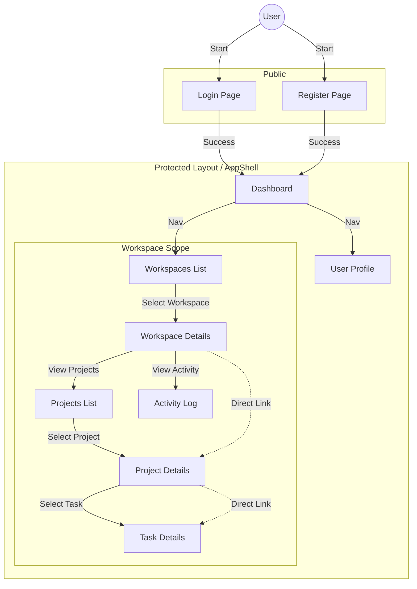
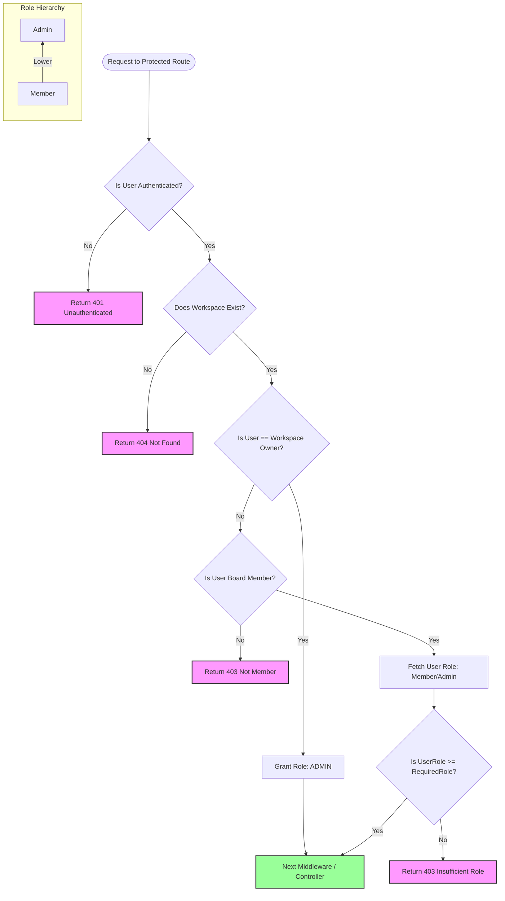

# Project Diagrams

## Visual Flow Diagram (User Navigation)

This diagram represents the user navigation flow within the frontend application.

## RBAC Flow Diagram (Backend Authorization)

This diagram details the logic flow in the `workspaceRoleGuard` middleware used for securing workspace routes.

